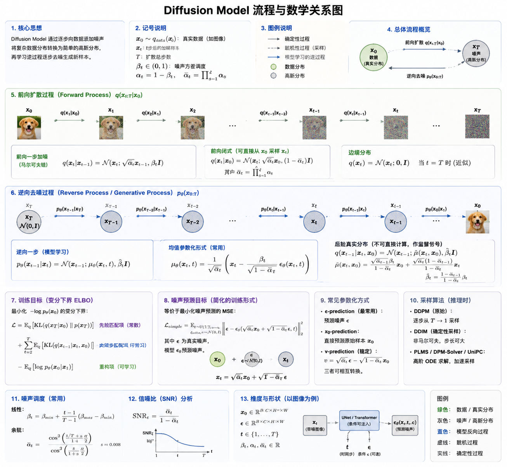

# 扩散模型(Diffusion Model)
author: 周均扬

date： 2026.05.07

---

**扩散模型（Diffusion Model）** 是近年来生成式 AI 领域最成功的范式之一，尤其在图像、视频、音频和 3D 生成中超越了 GANs 等早期方法。其核心思想源于非平衡热力学：通过逐步向数据添加噪声（前向扩散），然后训练模型学习逆转这一过程（逆向去噪）来生成新样本。

---

### 1. 原理（Principles）
扩散模型模拟一个“破坏-重建”的双过程：数据在高维空间逐渐“扩散”成噪声，然后模型学习逆过程，把噪声“收敛回”真实数据。

- **前向扩散过程（Forward Process）**：从真实数据 $x_0$ 开始，逐步添加高斯噪声，经过 $T$ 步后变为近似标准正态分布的纯噪声 $x_T \sim \mathcal{N}(0, I)$。这是一个固定的、马尔可夫链过程，不需要学习参数。它将复杂的数据分布逐步“扩散”成简单的高斯噪声，便于采样起点。

- **逆向过程（Reverse Process）**：从噪声 $x_T$ 开始，逐步去除噪声，恢复数据分布。模型学习预测每一步的噪声（或均值），从而生成高质量样本。这是一个学习的马尔可夫链，核心是训练神经网络（如 U-Net）来估计去噪方向。

**直观类比**：想象把一滴墨水滴入水中（前向扩散，墨水扩散成均匀混合），模型学习如何把均匀混合的水“逆转”回原来的墨滴（逆向）。实际中，前向是固定的破坏，逆向是学习的生成。

其他等价视角包括：
- **变分视角**（VAE-like）：最小化证据下界（ELBO）。
- **分数匹配视角**（Score-based）：学习数据分布的对数梯度（score function），用 Langevin 动力学采样。
- **连续视角**：用随机微分方程（SDE）或常微分方程（ODE）描述流动。

这些视角共享一个核心：用时间依赖的速度场将简单先验（噪声）运输到数据分布。

---

### 2. 数学推导（Mathematical Derivation）
以经典的 **Denoising Diffusion Probabilistic Models (DDPM)** 为例（Ho et al., 2020）。

#### 前向过程
定义马尔可夫链：
$$q(x_t \mid x_{t-1}) = \mathcal{N}(x_t; \sqrt{1 - \beta_t} x_{t-1}, \beta_t I)$$
其中 $\beta_t$ 是方差调度（variance schedule，通常线性或余弦，从小到大）。

闭形式（从$x_0$直接到$x_t$）：
$$x_t = \sqrt{\bar{\alpha}_t} x_0 + \sqrt{1 - \bar{\alpha}_t} \epsilon, \quad \epsilon \sim \mathcal{N}(0, I)$$
其中 $\alpha_t = 1 - \beta_t$，$\bar{\alpha}_t = \prod_{s=1}^t \alpha_s$。当 $T$ 足够大时，$\bar{\alpha}_T \approx 0$，$x_T \approx \mathcal{N}(0, I)$。

#### 逆向过程
理想逆向后验：
$$q(x_{t-1} \mid x_t, x_0) = \mathcal{N}(x_{t-1}; \tilde{\mu}_t(x_t, x_0), \tilde{\beta}_t I)$$
其中
$\tilde{\mu}_t = \frac{\sqrt{\bar{\alpha}_{t-1}} \beta_t}{1 - \bar{\alpha}_t} x_0 + \frac{\sqrt{\alpha_t} (1 - \bar{\alpha}_{t-1})}{1 - \bar{\alpha}_t} x_t$, 
$\quad \tilde{\beta}_t = \frac{1 - \bar{\alpha}_{t-1}}{1 - \bar{\alpha}_t} \beta_t$

模型参数化 $p_\theta(x_{t-1} \mid x_t) = \mathcal{N}(x_{t-1}$; $\mu_\theta(x_t, t), \Sigma_\theta(x_t, t))$。为简化，通常固定方差，只学习均值。

**重参数化技巧**：不直接预测 $\mu_\theta$ 或 $x_0$，而是让神经网络 $\epsilon_\theta(x_t, t)$ 预测添加的噪声 $\epsilon$。则：
$$\mu_\theta(x_t, t) = \frac{1}{\sqrt{\alpha_t}} \left( x_t - \frac{\beta_t}{\sqrt{1 - \bar{\alpha}_t}} \epsilon_\theta(x_t, t) \right)$$

#### 训练目标
将模型视为 VAE，用变分下界（ELBO）训练。ELBO 简化为噪声预测损失（denoising score matching）：
$$L(\theta) \approx \mathbb{E}_{t, x_0, \epsilon} \left[ \|\epsilon - \epsilon_\theta(\sqrt{\bar{\alpha}_t} x_0 + \sqrt{1 - \bar{\alpha}_t} \epsilon, t)\|^2 \right]$$

随机采样 $t$ 和 $\epsilon$，最小化这个 MSE 即可。

采样时：从 $x_T \sim \mathcal{N}(0,I)$ 开始，迭代使用 $p_\theta$ 去噪（可加随机性或用 DDIM 确定性采样）。

**连续极限**：前向对应 SDE（如 Ornstein-Uhlenbeck），逆向是概率流 ODE 或 reverse-time SDE，允许更快的采样（如 Flow Matching）。

---

### 3. 关键技术（Key Technologies）
- **Latent Diffusion Models (LDM / Stable Diffusion)**：在 VAE 的低维潜空间（latent space）而非像素空间进行扩散，大幅降低计算量（图像压缩 ~48 倍），使消费级 GPU 可运行。

- **U-Net / Transformer 骨干**：早期用 U-Net（带 skip connections 和 cross-attention for text conditioning）。后来转向 Diffusion Transformer (DiT) 或 MMDiT，提升 scaling 和多模态能力（如 Stable Diffusion 3）。

- **条件生成（Conditioning）**：Text-to-Image 用 CLIP/T5 编码器 + cross-attention；支持 img2img、inpainting、ControlNet（添加 pose/depth 控制）等。

- **加速采样**：DDIM（deterministic）、DPM-Solver、Consistency Models、Flow Matching 等，将数百步减少到 10-50 步甚至一步。

- **效率优化**：量化、蒸馏、LoRA 微调、分布式训练；小模型适配边缘设备。

- **多模态扩展**：视频（SVD）、3D（DreamFusion）、音频、分子等；与 LLM 结合的 Diffusion LLM。

- **训练技巧**：噪声调度优化、v-prediction、rectified flow 等提升稳定性与质量。

---

### 4. 工业应用（Industrial Applications）
扩散模型已从研究走向大规模工业部署，尤其在内容生成和设计领域。

- **媒体与娱乐**：Text-to-Image/Video（Stable Diffusion、Midjourney、Sora-like）、特效生成、游戏资产创建、个性化内容。显著降低制作成本和时间。

- **设计与制造**：生成式设计（产品原型、建筑）、智能控制、故障诊断。提升灵活性、可持续性和韧性（如 Industry 4.0/5.0）。

- **医疗与药物**：分子生成、逆向材料设计、合成数据增强、药物发现。扩散模型可生成符合特定属性的结构。

- **其他**：金融事件模拟、航空模拟、数据增强、电商个性化图像、广告、3D 建模、代码/文档编辑（Diffusion LLM）等。边缘设备小模型（如 FLUX 变体）支持本地部署。

**挑战与趋势**：计算效率（仍较高）、版权/安全问题、可控性、与世界模拟器结合（通用 AI）。效率优化、多模态和行业特定解决方案是重点，市场规模持续高速增长。

扩散模型的核心优势在于**高质量、多样性与可扩展性**，结合持续的架构和采样创新，已成为生成 AI 的主力范式。

