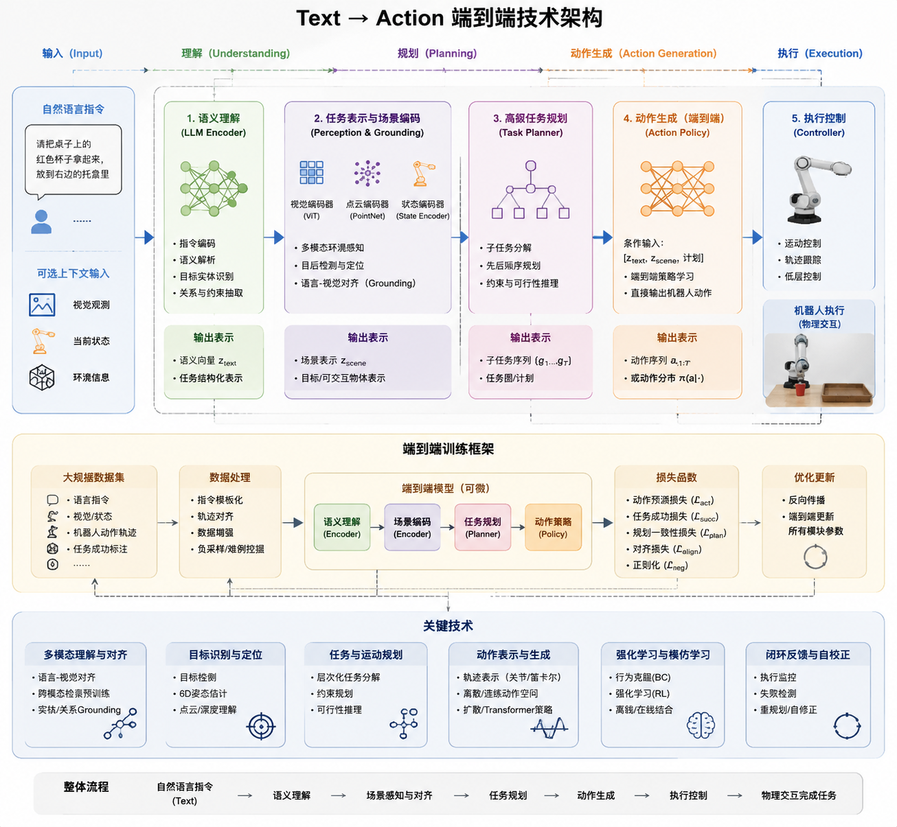

# 文生动作 (Text-to-Action)

author: 周均扬

date： 2026.05.10

---

## 1️⃣ 机理（原理层面）

“文生动作”本质上是 **自然语言 → 动作序列** 的映射任务，可以理解为一种 **跨模态生成**问题，即把语言信息转化为时空动作数据。核心原理可拆为三个方面：

1. **语义理解（Language Understanding）**

   * 将输入的文本（如“举起右手”）映射到语义表示。
   * 使用方法：

     * **预训练语言模型**：BERT、GPT、T5等编码文本特征。
     * **语义嵌入**：将动作相关的关键词或结构嵌入到向量空间。

2. **动作表示（Action Representation）**

   * 动作通常用 **人体关键点（Skeleton keypoints）** 或 **骨骼关节角度（Joint angles）** 表示。
   * 时空序列形式：
     $$A = {a_1, a_2, \dots, a_T}, \quad a_t \in \mathbb{R}^{J \times D}$$
     其中 (J) 是关节数，(D) 是坐标维度（2D或3D）。

3. **生成映射（Text-to-Action Mapping）**

   * 将文本特征映射到动作序列特征：

     * **直接回归**：语言向量 → 动作序列坐标
     * **序列生成**：

       * **RNN/LSTM/GRU**：预测动作的每一帧
       * **Transformer/Attention**：捕捉动作的长时依赖
     * **条件生成模型**：

       * VAE（Variational Autoencoder）：学习动作潜在空间
       * GAN（生成对抗网络）：提高动作的自然度

---

## 2️⃣ 实现过程（系统层面）

典型的 **Text-to-Action 系统**，实现流程可以拆成五步：

### Step 1：文本输入与处理

* 对文本进行**分词、语义解析、依存分析**。
* 可提取 **动作动词、主体、方向、时长等**。
* 输出 **文本嵌入向量**（sentence embedding）。

### Step 2：动作语义对齐

* 建立 **语言-动作对照表**，或者通过**深度网络自动学习对齐**。
* 技术手段：

  * CLIP 类对比学习（Text-Action 对比损失）
  * Embedding 对齐（共享潜在空间）

### Step 3：动作生成网络

* 核心模块：

  * **编码器（Encoder）**：输入文本向量
  * **解码器（Decoder）**：生成动作序列
* 网络架构：

  * Transformer Seq2Seq
  * Conditional VAE / Conditional GAN
* 损失函数：

  * **重构损失**：动作点坐标与真实动作误差
  * **平滑损失**：保证连续帧动作平滑
  * **对抗损失**：提升动作自然度

### Step 4：动作后处理

* 关键点平滑、动作时长调整、物理约束应用（如关节角度限制）。
* 可选动作混合、动作裁剪或循环生成。

### Step 5：输出动作

* 可输出：

  * **骨骼关键点序列** → 可在 3D 引擎中渲染
  * **骨骼动画文件**（BVH/FBX）
  * **机器人动作指令序列**

---

## 3️⃣ 关键技术

### 3.1 文本特征提取

* 预训练语言模型（BERT、GPT、T5）
* 动作语义词典（VerbNet、FrameNet）

### 3.2 动作特征建模

* **骨架关键点表示**（Joint angles / 3D coordinates）
* **时空序列建模**：

  * RNN/LSTM/GRU
  * Temporal Transformer / Graph Transformer
  * 图卷积网络（GCN）处理骨骼骨架结构

### 3.3 对齐与生成

* **文本-动作对齐**：

  * CLIP 风格的对比学习
  * Shared latent space（共享潜空间）
* **动作生成模型**：

  * Seq2Seq Transformer
  * Conditional VAE / GAN
  * Diffusion Models（扩散模型生成动作序列，近期 SOTA）

### 3.4 动作自然化

* Smoothness loss（平滑损失）
* Physical constraints（物理约束，如重心、关节角度限制）
* 动作风格迁移（Style Transfer）：调整动作风格（如“生气地走” vs “优雅地走”）

---

## 4️⃣ 技术路线图（简化示意）

```
文本输入 → 文本嵌入 → 文本-动作对齐 → 动作生成网络 → 动作后处理 → 输出骨架动作
```

可扩展：

* 添加情绪/风格条件 → Style-conditioned Text-to-Action
* 添加环境约束 → Environment-aware Action

---

💡 **总结**：

* **本质**：文本到动作是一个**跨模态序列生成**问题。
* **核心难点**：

  1. 文本与动作语义的精确对齐
  2. 动作时序的连续性与自然性
  3. 动作生成的多样性与可控性
* **趋势**：扩散模型、图神经网络和大型语言模型的结合，将进一步提升自然性和多样性。

---




