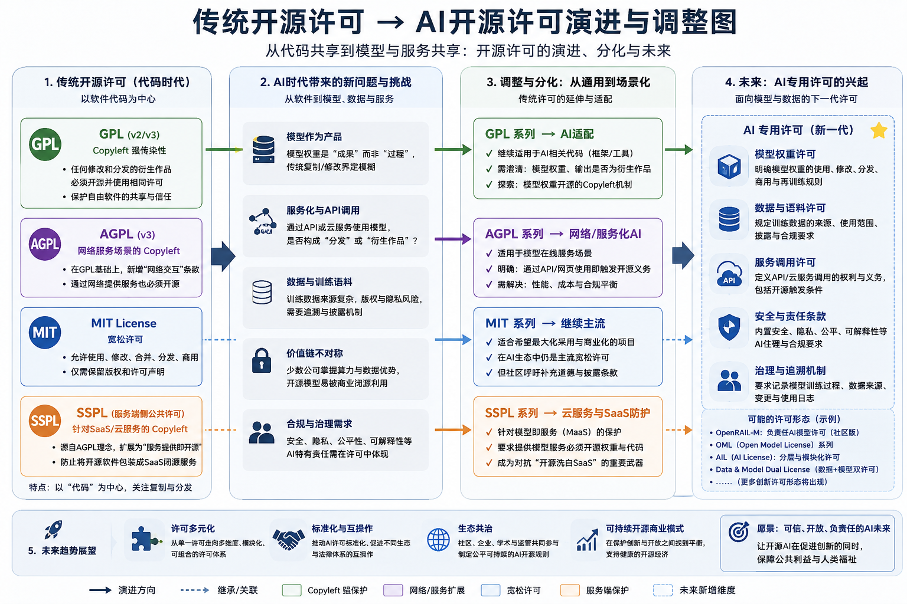

# AI时代的开源许可(Open Source Licenses in the AI Era)

author: 周均扬

date: 2026.05.10

---

在 **AI 时代**，开源许可面临的挑战和调整需求非常特殊，因为 AI 与传统软件在使用、分发和知识产权上的模式都有显著不同。以下从问题、调整方向以及未来趋势方面陈述。

---

## 一、AI 时代开源许可面临的主要问题

### 1. **“模型使用 vs 软件分发” 的灰色地带**

* 传统开源许可（GPL、AGPL、MIT 等）主要针对 **软件分发**
* AI 模型通常以 **权重/参数文件**形式存在，而不是传统可执行程序
* 典型问题：

  * 用户通过 API 或云服务调用模型，但不“分发”模型本身，是否触发开源义务？
  * AGPL 的网络条款在模型服务上是否生效存在争议

### 2. **数据与训练权利**

* AI 模型依赖大量数据训练，而数据本身可能是受版权保护的
* 开源许可通常只覆盖代码，但训练数据的版权复杂
* 问题：

  * 模型是否算“衍生作品”？
  * 修改或微调后的模型是否需要开源？
  * 数据集许可与模型许可如何协调？

### 3. **专利与知识产权冲突**

* AI 模型（尤其大模型）可能包含受专利保护的算法或架构
* 现有开源许可证通常不自动涵盖专利授权
* 企业担忧：

  * 开源模型被竞争对手用于商业服务可能引发专利诉讼

### 4. **商用限制与滥用问题**

* AI 模型被轻易复制、微调和商业化
* 完全宽松的 MIT/BSD 许可可能导致：

  * 小公司/研究机构开发的模型被大公司直接商业化
  * 原作者无法获得收益或控制滥用

### 5. **责任与伦理问题**

* AI 模型的输出可能造成偏见、歧视或违法行为
* 开源许可传统上不涉及使用后的责任，但 AI 模型的广泛应用迫使社区重新考虑**法律责任条款**

---

## 二、可能的开源许可调整方向

1. **网络与服务条款增强**

   * 类似 AGPLv3 的“网络使用触发开源”，未来可能扩展到 **模型权重或 API 调用**
   * 例如：使用开源模型提供服务必须公开微调后的权重或训练代码

2. **数据与训练许可分离**

   * 模型本身与训练数据的开源许可可能分开
   * 允许开源模型，但要求**训练数据遵循特定数据许可**

3. **商用限制许可（Copyleft+商业条款混合）**

   * 如 **SSPL（Server Side Public License）** 或 Elastic License
   * 对商业云服务商使用开源模型增加限制
   * 保护中小开发者利益，但仍允许研究和个人使用

4. **专利与权利明晰**

   * 新型 AI 许可证可能明确授予模型算法和架构的专利许可
   * 避免大型企业通过专利威胁阻碍开源模型的发展

5. **伦理和使用约束**

   * 增加“禁止用于军事或违法行为”条款
   * 目前法律约束力有限，但会作为社区规范和合规指引

---

## 三、未来发展趋势

1. **多层次许可体系**

   * 模型代码、权重、微调数据、训练数据各自有不同许可
   * 类似“开源+开数据+开服务”的组合体系

2. **“AI 专用开源许可证”兴起**

   * 例如：

     * **RORA（Responsible Open RA）**：附加责任条款
     * **OpenRAI License**：明确微调、云调用和衍生使用规则

3. **开源与商业化的协同**

   * 企业倾向双重许可策略：

     * 研究和社区免费开源
     * 商业 SaaS 收费，附加服务条款

4. **社区与法律并行推进**

   * 社区通过伦理声明、使用准则、许可更新引导使用
   * 法律逐步适应 AI 模型的新形式，开源许可与知识产权体系可能重新协调

5. **自治许可与智能合约**

   * 随着区块链和智能合约发展，未来可能出现：

     * 自动执行的 AI 开源许可
     * 使用模型触发开源义务或支付机制自动执行

---

### 🔹总结一句话

AI 时代的开源许可 **不再只是代码分发问题**，而是涵盖 **模型权重、训练数据、云服务使用、商用限制和伦理责任**，未来会演化成多层次、混合型、适配 AI 特性的许可体系。

---

 **传统开源许可 → AI开源许可演进与调整**

