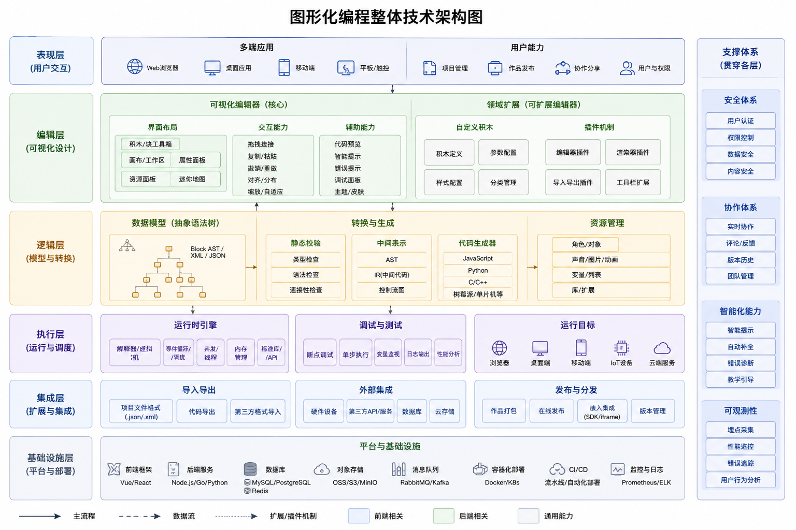
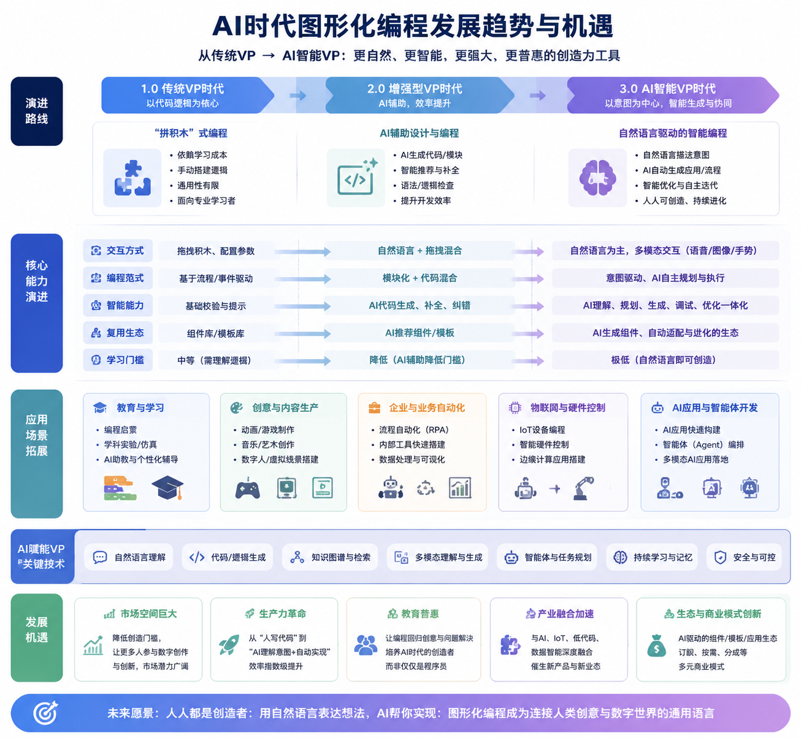

# AI时代的图形化编程(Visual Programming in the AI Era)

author: 周均扬

date： 2026.05.10

---

陈述**图形化编程（Visual Programming）的本质、工具及实现思路**，并列出当前主流开源工具及其优缺点。

---

## 1. 图形化编程的本质

图形化编程本质上是**用图形化的组件、节点或模块代替传统文本代码进行程序设计和逻辑表达**。核心理念：

1. **可视化思维**：程序逻辑通过节点、块、连线表示，便于直观理解。
2. **抽象化**：隐藏底层语言细节，通过操作图形组件实现代码功能。
3. **模块化与组合**：程序由节点或模块组合而成，每个模块封装特定功能。
4. **自动生成代码/运行时解释**：底层通常有：

   * 生成代码（JavaScript、Python等）
   * 解释执行（节点事件驱动、数据流调度）

**核心目标**：降低编程门槛、提高逻辑可视化和快速原型开发效率。

---

## 2.  图形化编程的实现思路

从技术角度，通常包含几个核心模块：

| 模块            | 功能                                                     |
| ------------- | ------------------------------------------------------ |
| **前端可视化编辑器**  | 拖拽节点、连线，显示数据流或控制流，通常基于HTML5 Canvas / SVG / WebGL / Qt等 |
| **节点/模块定义系统** | 每个模块封装功能接口（输入、输出），可能带有配置参数                             |
| **逻辑调度/运行时**  | 管理节点执行顺序或数据流，支持同步或异步运行                                 |
| **代码生成或解释器**  | 将图形化逻辑转成底层代码，或者直接在运行时解释执行                              |
| **数据存储与导入导出** | 保存图形化工程状态（JSON、XML、YAML），便于复用和分享                       |

**两种典型执行模型**：

1. **数据流驱动（Dataflow）**

   * 节点间通过数据“流”触发执行
   * 示例：Node-RED、LabVIEW
   * 特点：适合信号处理、IoT、流程控制

2. **控制流驱动（Control flow / Block-based）**

   * 节点按逻辑顺序执行，类似程序语句块
   * 示例：Scratch、Blockly
   * 特点：教育、游戏开发、快速原型

---

## 3. 主流开源图形化编程工具

| 工具                | 类型                  | 语言/平台       | 优点                                                   | 缺点                                 |
| ----------------- | ------------------- | ----------- | ---------------------------------------------------- | ---------------------------------- |
| **Blockly**       | Block-based         | JS (浏览器)    | 1. 易上手，教育用途广泛 2. 可生成 JS/Python/其他语言代码 3. 高度可定制 | 1. 不适合复杂大规模项目 2. 数据流能力弱         |
| **Node-RED**      | Dataflow            | JS/Node.js  | 1. IoT 和自动化非常方便 2. 丰富节点生态 3. Web可视化            | 1. 面向后端/IoT，前端交互弱 2. 大规模逻辑可读性下降 |
| **n8n**           | Dataflow / Workflow | JS/Node.js  | 1. 集成 SaaS 自动化 2. 可扩展自定义节点 3. REST API 支持好     | 1. 面向工作流，编程能力有限 2. 高级逻辑不够直观     |
| **Snap!**         | Block-based         | JS (浏览器)    | 1. 类似Scratch，但更强大 2. 支持函数、列表、高阶编程                 | 1. 浏览器性能限制 2. 工业级应用有限           |
| **PyFlow**        | Node-based          | Python      | 1. 面向科学计算和3D视觉 2. Python生态直接用                     | 1. 维护活跃度低 2. 文档相对少              |
| **Litegraph.js**  | Node-based          | JS (浏览器)    | 1. 轻量、易集成 2. 可做实时图形/游戏逻辑                          | 1. 节点库有限 2. 大项目扩展性一般            |
| **DRAKON Editor** | Flowchart-based     | JS / Python | 1. 可读性非常高 2. 流程图风格统一                              | 1. 节点功能封装不够丰富 2. 教育/工业适用性受限     |

> 注：Node-based ≈ 数据流导向，Block-based ≈ 控制流或教育导向。

---

## 4. 实现思路总结（开发新工具可参考）

如果要从零实现一个图形化编程工具，一般流程：

1. **节点建模**

   * 定义节点类型（输入、逻辑、输出）
   * 定义接口（输入输出端口、参数、事件）

2. **前端可视化**

   * Canvas / SVG 绘制节点和连线
   * 支持拖拽、缩放、选中、连线

3. **逻辑调度引擎**

   * 数据流驱动：当输入变化 → 触发节点计算 → 输出传递
   * 控制流驱动：按顺序执行节点

4. **代码生成或解释**

   * 将图形化逻辑导出为 Python/JS/C++
   * 或实现即时解释器运行节点逻辑

5. **工程保存与复用**

   * JSON/XML 存储节点状态、连线、参数
   * 支持导入导出

---

**图形化编程的整体技术架构图**

---

## 5. AI时代的图形化编程(Visual Programming in the AI Era)

在**AI时代**，图形化编程（Visual Programming, VP）面临着新的发展环境与机遇，其本质依然延续**“降低编程门槛、提高逻辑可视化”**的理念。

---

### 1. 图形化编程的本质在AI时代的延伸

传统VP强调**拖拽式模块化、数据流/控制流可视化**，而在AI时代，它更强调：

1. **智能化抽象**

   * 自动将复杂算法封装为可视化模块，如深度学习模型、数据处理管道。
   * 用户不必写代码即可调用AI能力（图像识别、文本生成、决策推荐）。

2. **数据驱动与AI集成**

   * 节点不仅处理逻辑，还能处理数据特征、训练模型、推理预测。
   * 支持在线学习、自动调参、模型优化可视化。

3. **低门槛复杂逻辑实现**

   * AI可辅助生成节点布局、推荐节点组合、自动连接数据流。
   * 对非程序员、教育或工业领域都更友好。

4. **可解释性与可调试性增强**

   * AI模型输出通常黑箱，VP可提供中间节点可视化，帮助理解和调试。

---

## 2. 调整方向

AI时代对图形化编程提出了新的技术调整需求：

| 方向                | 调整说明                        |
| ----------------- | --------------------------- |
| **智能节点生成**        | 根据用户需求自动推荐或生成节点组合，减少人工拖拽和编码 |
| **AI驱动数据流优化**     | 自动规划节点执行顺序、资源分配、并行调度        |
| **多模态集成**         | 支持图像、文本、语音、传感器数据的统一可视化处理    |
| **低代码/无代码与可编程结合** | VP模块可自动生成可运行代码，同时保留手动扩展能力   |
| **可解释性与监控**       | 通过可视化中间状态、日志和性能指标，增强AI决策透明度 |
| **跨平台与云原生**       | Web、移动端、IoT、云服务无缝集成，支持分布式计算 |

---

## 3️. AI时代的发展机遇

1. **教育和培训领域**

   * AI辅助VP降低编程门槛，实现个性化学习路径。
   * 可视化训练和实验模拟，加速 STEM 教育创新。

2. **工业自动化与IoT**

   * AI算法与图形化流程结合，实现工厂流程优化、智能控制和故障预测。

3. **数据科学和自动化工作流**

   * VP可作为“AI管道搭建工具”，拖拽节点完成数据清洗、特征工程、模型训练和部署。
   * 如 Node-RED、n8n 结合AI模型，实现企业自动化。

4. **创意和设计工具**

   * AI驱动的图形化工具支持创作者快速生成图像、动画、音乐或交互内容。
   * 典型示例：Stable Diffusion 的可视化节点编辑器（如 ComfyUI）。

5. **低代码/无代码平台进化**

   * VP与AI结合，形成**智能低代码平台**，可自动生成逻辑和优化性能。
   * 降低企业数字化转型的技术门槛。

---

## 4️.  总结

**核心变化**：

* 从“可视化逻辑表达” → “可视化+智能化决策”，数据与模型成为第一类公民。
* 从“低门槛编程” → “低门槛复杂AI流程搭建”，AI算法和数据处理能力直接可视化。
* VP 不只是教育工具，也成为 AI 开发、自动化、创意生产和工业控制的核心接口。

**发展机遇**：

* 教育、创意产业、企业自动化、IoT和数据科学的广泛应用。
* 结合 AI 的可视化编程工具将成为**跨专业、跨行业的生产力平台**。

---

**AI时代图形化编程发展趋势与机遇图**，用图形化方式展示从传统VP → AI智能VP的演进路线及应用场景。

