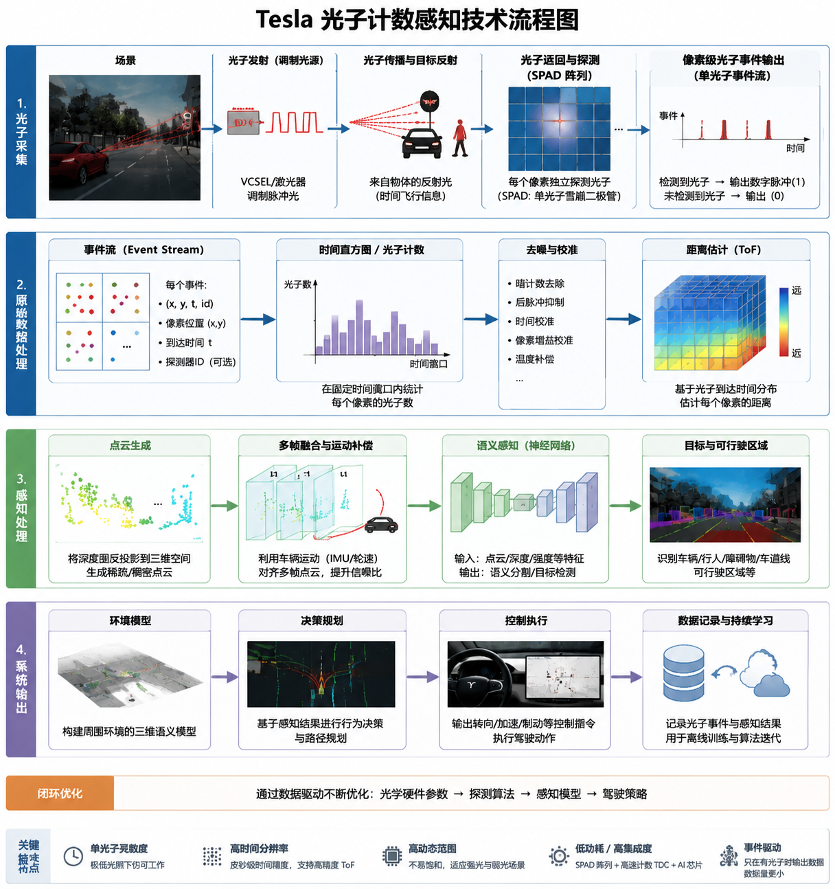

# 特斯拉的光子计数感知技术

author: 周均扬

date： 2026.05.15

---

从**本质、机理、数学推导以及应用场景**四个维度，介绍特斯拉（Tesla）提出的“光子计数（Photon Counting）”感知技术。并提出光子计数感知技术的发展趋势及面临的挑战。

## 1. **本质理解**

### 1. **概念核心**

   * 光子计数（Photon Counting）是指在极低光照条件下，通过检测单个光子的到达来获取环境信息的一种技术。
   * 与传统摄像头使用**电荷积分**（collect charge over exposure time）方式不同，光子计数技术是**离散、量子级别**的光探测方式。
   * 对特斯拉而言，其目的是在**夜间或弱光环境**下保持高精度视觉感知，而不依赖激光雷达（LiDAR）。

### 2. **区别于传统相机**

   | 维度   | 传统CMOS/CCD | 光子计数                       |
   | ---- | ---------- | -------------------------- |
   | 探测单位 | 多光子累积电荷    | 单光子                        |
   | 信噪比  | 受曝光时间和光量限制 | 高灵敏度，即使低光也可探测              |
   | 响应速度 | 毫秒量级       | 纳秒到皮秒量级（取决于SPAD等器件）        |
   | 典型器件 | CMOS, CCD  | SPAD（单光子雪崩二极管）或Geiger模式APD |

### 3. **特斯拉应用场景**

   * 夜间驾驶视觉增强
   * 对远距离微弱光源（如远处反光标志、行人衣物反光）更敏感
   * 高速场景下减少曝光时间，提高运动目标识别精度

---

## 2. **技术机理**

### 1. **硬件基础：SPAD（Single-Photon Avalanche Diode）**

   * SPAD是一种**雪崩光电二极管**，工作在高电压（超击穿电压）下，每个入射光子触发一次雪崩放大事件，输出标准电信号。
   * 特点：

     * 单光子触发
     * 响应时间极短（几十皮秒）
     * 可通过微型阵列构建二维成像

### 2. **信号处理机理**

   * 单光子事件 → 时间戳记录 → 多光子累积构建图像
   * 对于动态场景：

     * 光子计数可直接得到**时间分辨成像**（Time-of-Flight或动态光子流）
     * 可以与运动估计算法结合，提升目标检测和跟踪精度

### 3. **光子计数与噪声**

   * 噪声来源：暗计数（Dark Count）、散射光、环境噪声
   * 采用**概率模型**处理，通常用**泊松分布**描述光子到达： $P(k;\lambda) = \frac{\lambda^k e^{-\lambda}}{k!}$
   * 其中 $k$ 是某像素计数到的光子数，$\lambda$ 是平均光子到达率。
   * 通过统计累积和滤波，可恢复低光强下的图像。

---

## 3. **数学推导及建模**

### 1. **光子到达的统计模型（泊松过程）**

   * 假设像素接收到的光子数为 (N(t))：$N(t) \sim \text{Poisson}(\lambda t)$
   * $\lambda$ 为每单位时间入射光子率，(t) 为采样时间。
   * 期望和方差：$E[N] = \lambda t, \quad \text{Var}(N) = \lambda t$

### 2. **图像恢复**

   * 假设原始图像亮度 $I(x,y)$ 与光子到达率 $\lambda(x,y)$ 成正比：$\lambda(x,y) = \eta I(x,y)$， $\eta$ 为探测器效率。
   * 采样多个时间帧后，可用最大似然估计（MLE）恢复图像：$\hat{I}(x,y) = \arg\max_{I} \prod_{t} P(N_t(x,y);\lambda = \eta I(x,y))$

### 3. **时间分辨光子计数（Time-Resolved Photon Counting）**

   * 对于运动目标或主动照明（如闪光/结构光），测量光子到达时间 $t_i$： $\text{TOF}(x,y) = \frac{1}{n} \sum_{i=1}^{n} t_i$
   * 结合TOF，可直接计算物体距离 $d = c \cdot \text{TOF}/2$
   * 对特斯拉来说，即可实现**弱光3D感知**，无需LiDAR

### 4. **噪声抑制与滤波**

   * 典型方法：

     * 时域平均：累积多帧光子计数
     * 空域滤波：邻域泊松去噪（Poisson Denoising）
     * 贝叶斯估计：$\hat{I} = \arg\max_{I} P(I|N) \propto P(N|I) P(I)$

---

## 4. **应用维度**

### 1. **夜间驾驶增强**

   * 光子计数摄像头在微光条件下，仍能检测远距离车辆、行人和标志
   * 替代传统增益提升（ISO），减少噪点

### 2. **高速动态感知**

   * 传统CMOS曝光时间长会产生动态模糊
   * 光子计数按纳秒级采样，可获取清晰动态图像
   * 可与光流算法结合，提高ADAS/Autopilot的预测能力

### 3. **低功耗视觉**

   * 每个像素只需统计光子事件，无需长时间曝光
   * 对电动车电力系统友好，减少夜间视觉系统功耗

### 4. **与AI融合**

   * 光子计数提供的**稀疏、高精度光子图像**
   * 可直接输入神经网络进行：

     * 语义分割（行人/车辆识别）
     * 深度预测（距离/3D重建）
     * 运动估计（时间光子流）

---

## 5. **发展趋势与挑战**

### 1. **趋势**

   * CMOS兼容SPAD阵列逐步商业化
   * 光子计数 + 神经网络联合优化，提升低光环境感知精度
   * 可能逐渐替代传统增强型低光摄像头（如Sony STARVIS）

### 2. **挑战**

   * SPAD制造成本高，单芯片像素数有限
   * 暗计数噪声仍需硬件与算法联合抑制
   * 数据处理量大，需要边缘计算和高效压缩

---

## 6. **总结**

特斯拉的光子计数技术本质上是一种**量子级光学感知方法**，通过单光子检测极大增强夜间/弱光场景下的视觉能力。它的核心机理依赖SPAD阵列与泊松统计建模，结合时间分辨光子计数可获得弱光下的距离与运动信息。在应用上，它能显著提升ADAS与全自动驾驶系统的夜间感知可靠性，同时有潜力降低功耗。未来，光子计数与神经网络结合将成为低光、高速动态场景感知的关键技术路线。

---

**特斯拉光子计数感知计数图**

