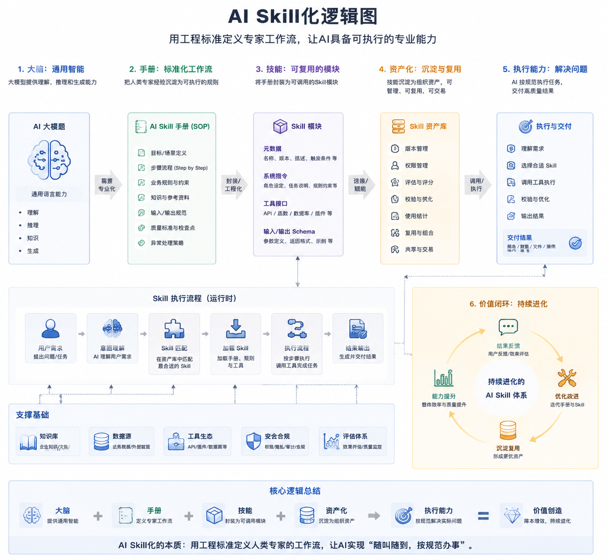

# **AI Skill化：让AI像专家一样“按规操作”**

author: 周均扬

date: 2026.05.15

---

## **1. 什么是AI Skill化？**

AI Skill化是把人工智能（尤其是大型语言模型LLM）的能力，拆分成**可执行、可复用的小技能（Skill）**。
简单来说，Skill就是AI可以直接做的事情，比如：

* 帮你写邮件
* 生成会议纪要
* 查询数据库信息
* 自动生成报表

Skill让AI不只是“会说话”，而是**会做事**。

---

## **2. Skill是怎么工作的？**

每个Skill都像是一份**工作说明书**，包含：

1. **执行流程**

   * AI按步骤完成任务，比如先读取信息、再生成报告、最后发送邮件。

2. **工具接口**

   * Skill可以调用系统或网络工具（API、函数、数据库）完成操作。

3. **触发条件**

   * 当你发出指令或达到某个条件时，Skill会自动执行。

> 举例：你对AI说“帮我生成上周销售报表”，AI Skill会自动：
>
> 1. 读取销售数据
> 2. 按模板生成报表
> 3. 发邮件给相关人员

---

## **3. 为什么Skill重要？**

1. **从大脑到手的跨越**

   * 大模型懂很多东西，但不一定知道怎么做。Skill把“知道”变成“能做”。

2. **流程标准化**

   * Skill把专家经验、公司流程固化成可重复操作的模块，避免出错。

3. **可复用和可组合**

   * 不同Skill可以组合完成复杂任务，比如“生成报告 + 翻译 + 邮件发送”。

4. **知识资产化**

   * 公司的经验、流程、最佳实践可以通过Skill沉淀下来，团队成员都能直接使用。

---

## **4. Skill化AI的未来**

* **随叫随到，按规范办事**：AI不仅会回答问题，还能完成操作。
* **企业生产力提升**：Skill减少重复劳动，让团队专注创造价值。
* **可扩展生态**：未来可能出现Skill市场，企业可以购买或共享高质量Skill模块。
* **与大模型结合**：大模型负责思考与理解，Skill负责执行，形成“智能大脑+实操手”的组合。

---

## **5. 小结**

AI Skill化就是把AI变得像专业员工一样：

* **懂流程**
* **能操作**
* **按规范办事**
* **经验可复制**

它让AI从“聊天工具”进化为真正的“数字助手”，可以解决复杂任务，提高效率。

---

**可视化说明**，把“AI大脑 → Skill → 执行 → 资产化”的流程直观呈现。

